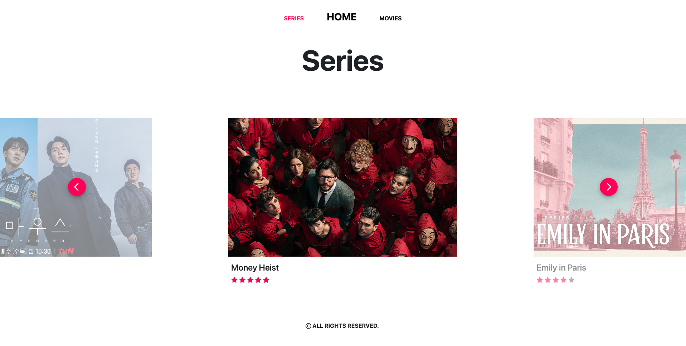
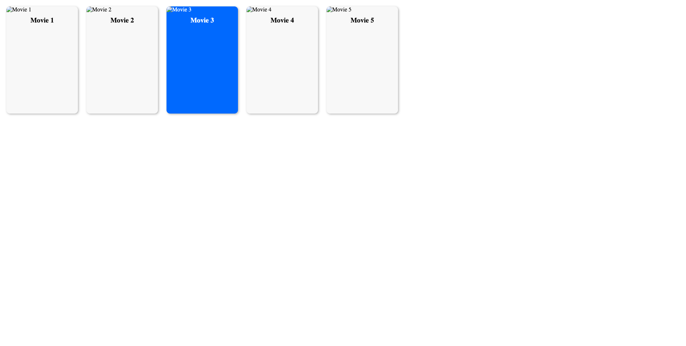

# 11056-Project 2: Outside the Grid

In this project, I have created a simple and minimal Watch List website with two main parts: Series and Movies. Users can view a film's rating, genre, duration and overview on the website. Throughout the process, I learned a lot about HTML, CSS, and JavaScript, and how they work together to create a dynamic and engaging website.

"Generate a one-page website with an interactive slider presenting movies horizontally using HTML and CSS". The website was initially generated using ChatGPT, which gave me a very basic framework. From there, I developed a website that suits my style and is suitable for the content. (initial website)

One of the most important things I learned was the importance of planning and organisation. While building the website, the design did not turn out as good as the prototypes and was too basic to me so I decided to redo it and go outside the box to try new layouts. Using ChatGPT can save time and be really helpful when we have a clear idea of what we want to achieve. I should have been clear about what features I wanted to include and how it should look. Bootstrap was also really useful for quick styling, and I used it to style some text and layout. The code was organised in a way that was easy to understand and modify, and the website is responsive for different screen sizes.

Another important aspect of the website making process was problem-solving. There were many times when I encountered errors or unexpected behaviour in the code, and I had to figure out how to fix them. For example, I had some trouble with the responsive slider, which uses JavaScript to move components. It required a lot of trial and error, as well as research and experimentation, to achieve the layout and feature that I wanted. I also encountered some issues with the overlay texts that I found a way to overcome but I believe there must be a more efficient one.

Overall, I found the website making process to be a fun and rewarding experience. It allowed me to be creative and express myself in a new way, while also learning valuable skills that I can apply in the future. I am excited to continue working on this project and adding new features to make it even more user-friendly and engaging.